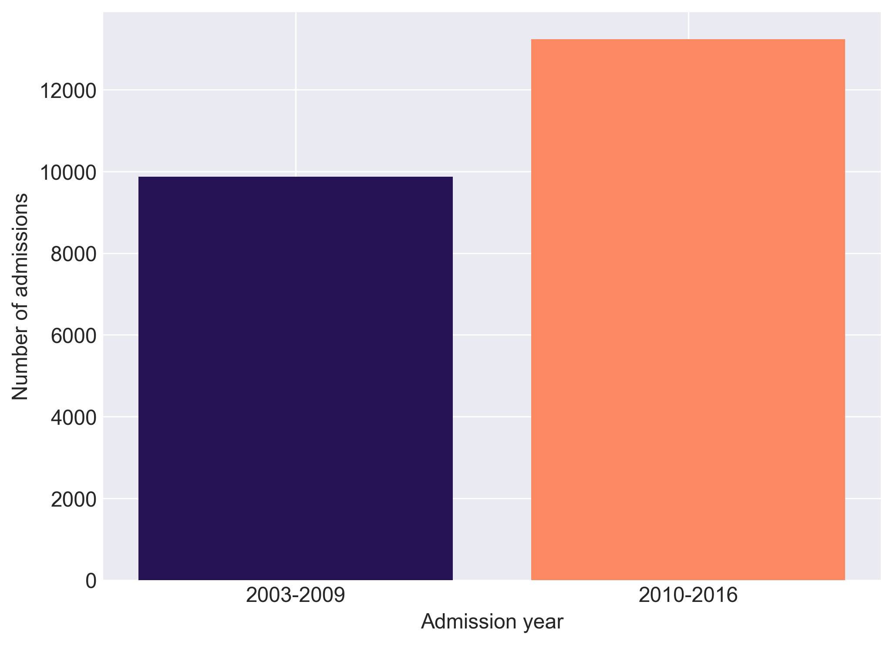
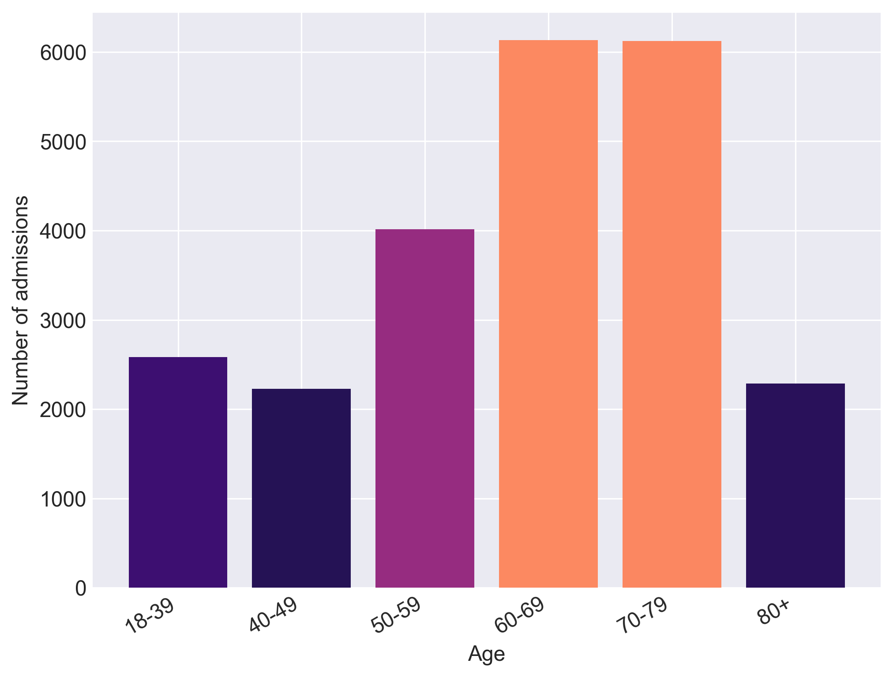

# Welcome
AmsterdamUMCdb is the first freely accessible European intensive care database. It is endorsed by the European Society of Intensive Care Medicine (ESICM) and its Data Science Section. It contains de-identified health data related to tens of thousands of intensive care unit admissions, including demographics, vital signs, laboratory tests and medications.

# Version
The current version of AmsterdamUMCdb is 1.0.1, released in January 2020. This version contains data related to 23,172 intensive care unit and high dependency unit admissions of adult patients from 2003-2016. The first version of AmsterdamUMCdb (1.0) was released in November 2019.

# Requesting Access
The database, although de-identified, still contains detailed information regarding the clinical care of patients, so must be treated with appropriate care and respect and cannot be shared without permission. To request access, go to the [Amsterdam Medical Data Science](https://amsterdammedicaldatascience.nl/) website.

# Facts and Figures
The current database contains data from the clinical patient data management system of the department of Intensive Care, a mixed medical-surgical ICU, from Amsterdam University Medical Center. The clinical data contains 23,172 admissions from 20,127 patients admitted from 2003 to 2016 with a total of almost 1.0 billion clinical observations consisting of vitals, clinical scoring systems, device data and lab results data and nearly 5.0 million medication records.

# Available tables
The table and field definitions are available from the [AmsterdamUMCdb wiki](https://github.com/AmsterdamUMC/AmsterdamUMCdb/wiki) and from Jupyter Notebooks in the [tables](tables/) folder.

|Table name|Description|
|:---|:---|
|[admissions](https://github.com/AmsterdamUMC/AmsterdamUMCdb/wiki/admissions)|admissions and demographic data of the patients admitted to the ICU or MCU|
|[drugitems](https://github.com/AmsterdamUMC/AmsterdamUMCdb/wiki/drugitems)|medication orders including fluids, (parenteral) feeding and blood transfusions during the stay on the ICU|
|[freetextitems](https://github.com/AmsterdamUMC/AmsterdamUMCdb/wiki/freetextitems)|observations, including laboratory results, that are based on non-numeric (text) data|
|[listitems](https://github.com/AmsterdamUMC/AmsterdamUMCdb/wiki/listitems)|categorial observations, e.g. based on a selection from a list, like type of heart rhytm, ventilatory mode, etc.|
|[numericitems](https://github.com/AmsterdamUMC/AmsterdamUMCdb/wiki/numericitems)| numerical measurements and observations, including vital parameters, data from medical devices, lab results, outputs from drains and foley-catheters, scores etc.|
|[procedureorderitems](https://github.com/AmsterdamUMC/AmsterdamUMCdb/wiki/procedureorderitems)|procedures and tasks, such as performing a chest X-ray, drawing blood and daily ICU nursing care and scoring|
|[processitems](https://github.com/AmsterdamUMC/AmsterdamUMCdb/wiki/processitems)|catheters, drains, tubes, and continous non-medication processes (e.g. renal replacement therapy, hypothermia induction, etc.)|
